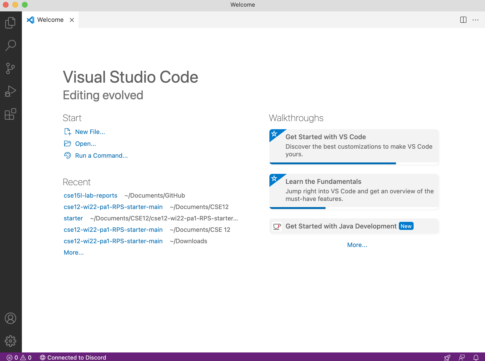
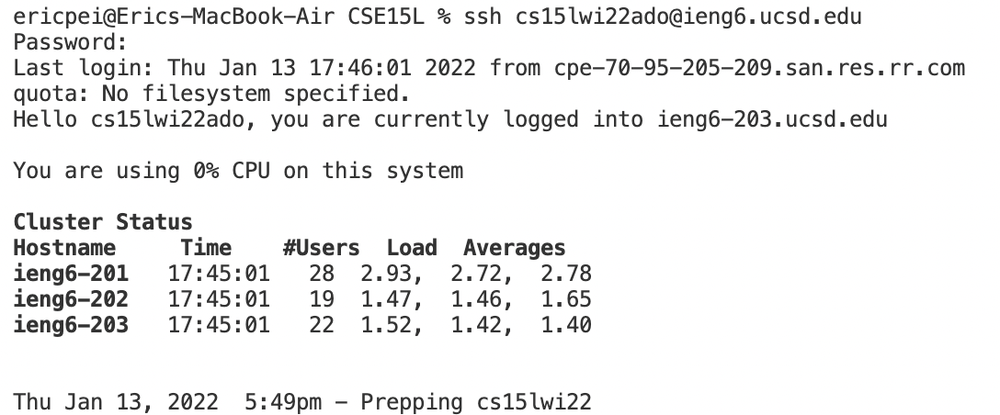
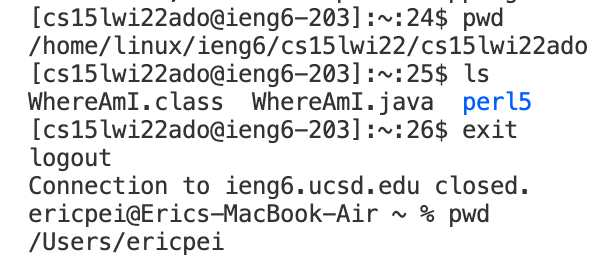
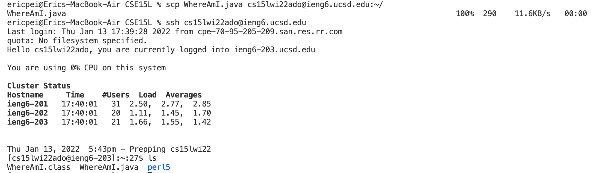
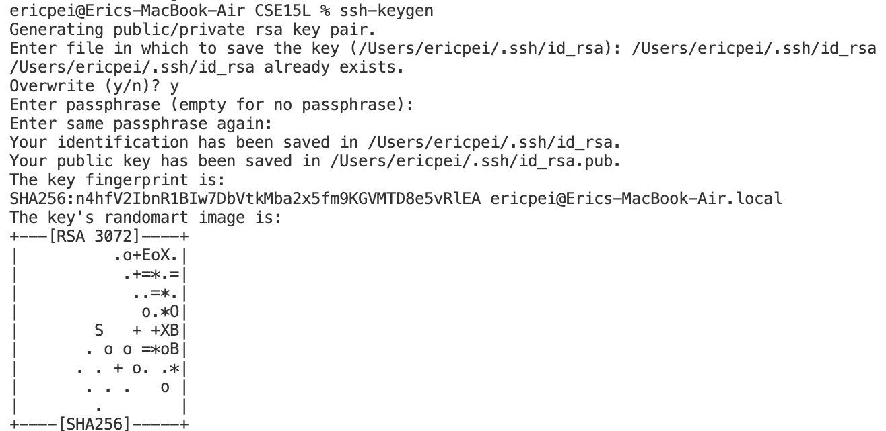
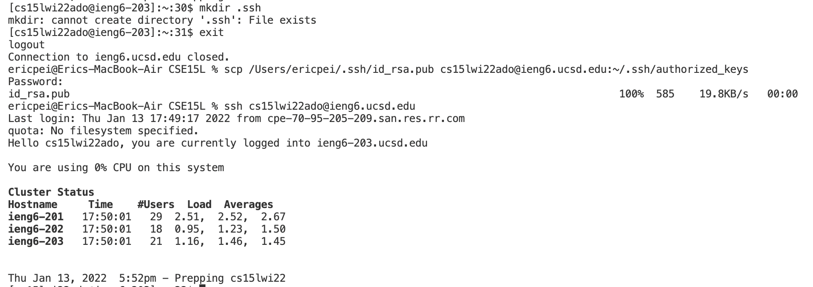
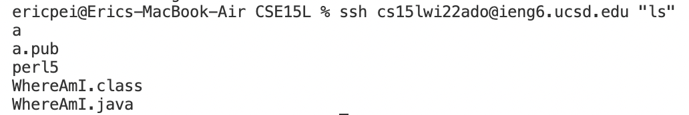

# __Week 2 Lab Report__

I'll be showing you how to connect your computer remotely to one of the computers in the CSE lab, as well as certain useful commands you can run.
   

## Steps Required:
* Installing VSCode
* Remotely Connecting
* Trying Some Commands
* Moving Files with `scp`
* Setting an SSH Key
* Optimizing Remote Running
   

# Part 1 - Installing VSCode
First, I downloaded VSCode [here](https://code.visualstudio.com). In addition, I also download Java to ensure that VSCode worked. Everything was fairly straightforward, as I had no problems installing and using VSCode.
   

# Part 2 - Remotely Connecting
First, I went to the website below to find the name of my account:
   
[https://sdacs.ucsd.edu/~icc/index.php](https://sdacs.ucsd.edu/~icc/index.php)
   
Then, I opened a terminal in VSCode and typed in the command:
   
`ssh cs15lwi22ado@ieng6.ucsd.edu`
   
I typed `yes` when prompted, and then typed in my password for my account. After logging in, my terminal looked like this:
   

   

# Part 3 - Trying Some Commands
In my VSCode terminal, I tried the commands `pwd` and `ls` while connected to the remote server. Then, I logged out using `exit` and tried the same commands on my client.
   

# Part 4 - Moving Files with scp
I copied a file on my client called `WhereAmI.java` over to the remote server with the command:
   
`scp WhereAmI.java cs15lwi22ado@ieng6.ucsd.edu:~/`
   
I ran `ls` while connected to the remote server, and I saw that `WhereAmI.java` had been successfully copied over. I was also able to run `WhereAmI.java` on the remote server.
   

# Part 5 - Setting an SSH Key
An `ssh` key allowed me to connect to the remote server without entering a password, making the process much faster. I did this by using the command:
   
`ssh-keygen`
   

This created a pair of files (a public and private key). I then copied the _public_ key over to my account on the server. On the server, I typed:
   
`mkdir .ssh`
  
Afterwards, I typed this command (on my client):
   
`scp /Users/ericpei/.ssh/id_rsa.pub cs15lwi22ado@ieng6.ucsd.edu:~/.ssh/authorized_keys`
   

 
After this, I was able to connect to the remote server without a password.

# Part 6 - Optimizing Remote Running
There were more efficient ways of running commands on the server. 
   
Normally, to run a command on the server starting from the client, I'd have connect to the server first with
   
`ssh cs15lwi22ado@ieng6.ucsd.edu`
   
Then, I'd type a command, like `ls`, before typing `exit` to return to my client.
   
This whole process would take **37** keystrokes.
   
To make this process faster, I pressed the up arrow on my keyboard to get the last command that I ran (`ssh cs15lwi22ado@ieng6.ucsd.edu`). Then, I typed `"ls"` right after and ran this single command:
   
`ssh cs15lwi22ado@ieng6.ucsd.edu "ls"`
   

   
This allowed me to show the files in the directory of the server without actually connecting to the server and needing to type `exit` to return to the client.
   
This whole process only took **6** keystrokes, and made remote running much more efficient.
   
That concludes the end of my lab report.
   

[Go back to home page](https://ericwpei.github.io/cse15l-lab-reports/)