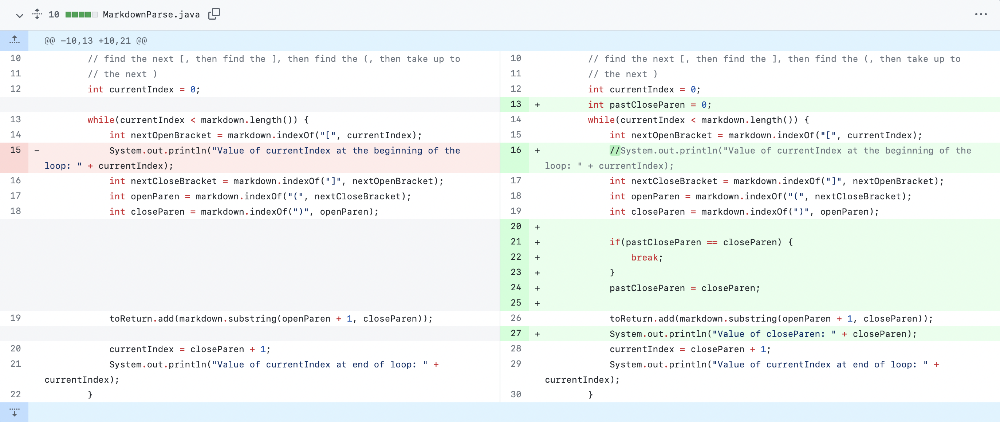
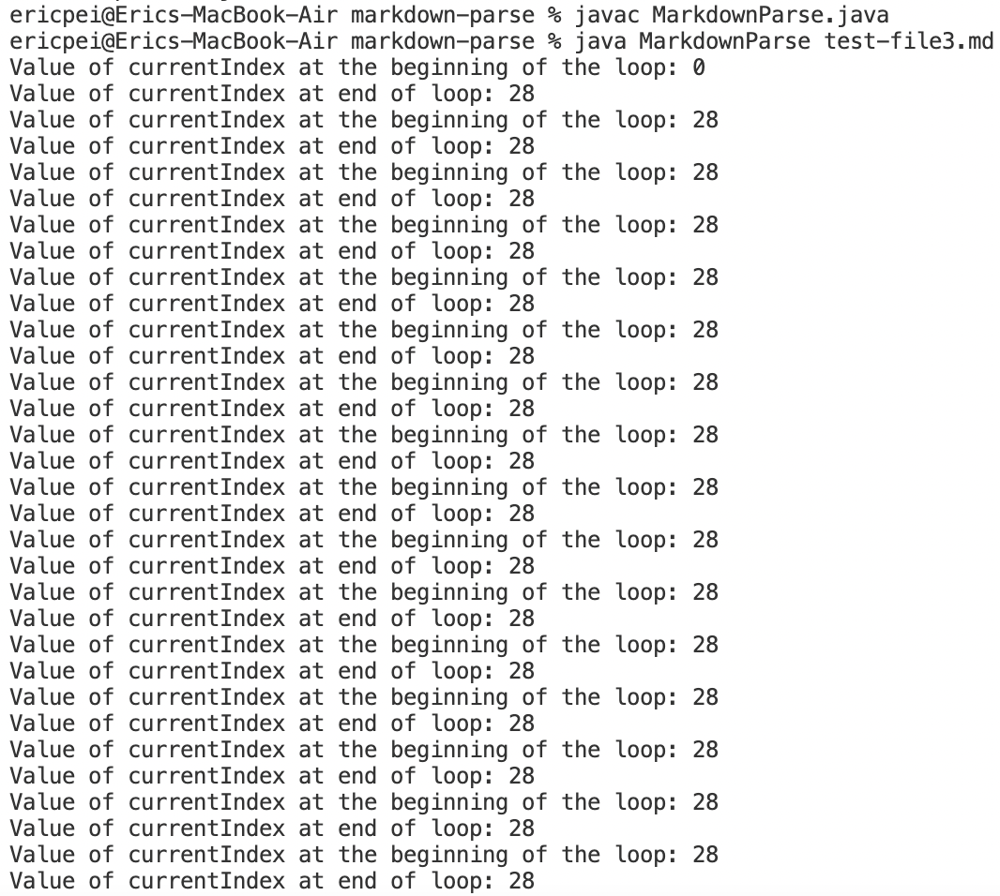
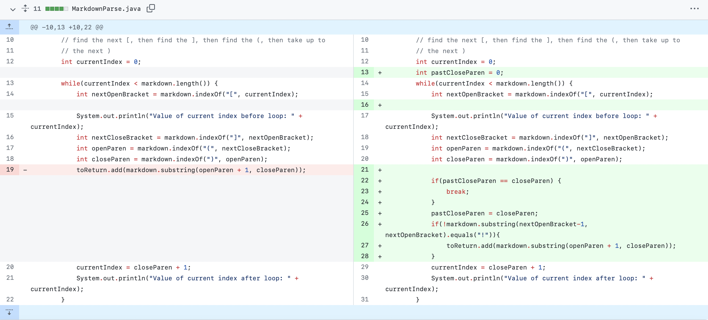
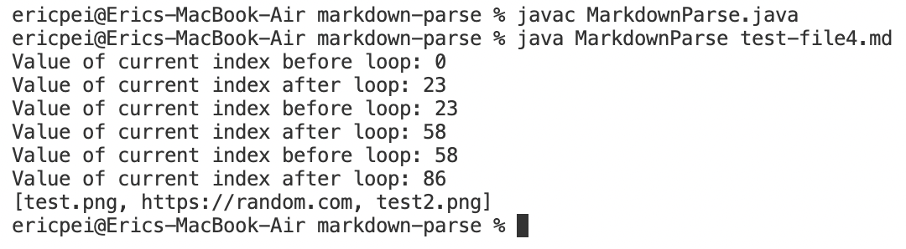
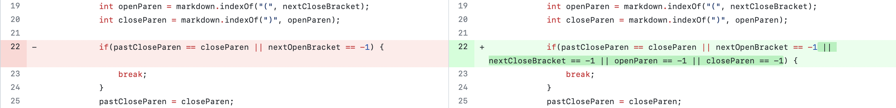
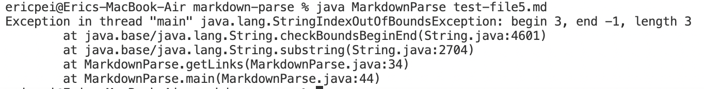

# __Week 4 Lab Report__

This page shows the process of progressively editing and improving code by looking at bugs, symptoms, and failure-inducing input. Failure-inducing input would allow us to see symptoms in the output, which notified us that there was a bug in the code that we needed to address.
   

## Table of Contents:
* First Code Change
* Second Code Change
* Third Code Change
   

# First Code Change - Fixing an Infinite Loop
Code Before and After:
   

   
[Test File Containing Failure-Inducing Input](https://raw.githubusercontent.com/ericwpei/markdown-parse/main/test-file3.md)
   
Symptom of Failure-Inducing Input:
   

   
The bug in the code that caused this infinite loop symptom to happen was that the condition of the while loop would never be false, since `currentIndex` would not update after the first link. The failure-inducing input did not end with a link, so `currentIndex` (which is equal to `closeParen + 1`) would never equal `markdown.length()`, meaning the while loop would never stop running.
   

# Second Code Change - Making the Output Include Only Links, Not Images
Code Before and After:
   

   
[Test File Containing Failure-Inducing Input](https://raw.githubusercontent.com/ericwpei/markdown-parse/main/test-file4.md)
   
Symptom of Failure-Inducing Input:
   

   
The symptom was that the output would include images (the program is supposed to only output links). The failure-inducing input had images and a link in it, and the bug is that `getLinks()` would mistake those images for links. This was because `getLinks()` had no implementation yet to distinguish between a link and an image.
   

# Third Code Change - Fixing an IndexOutOfBoundsException
Code Before and After:
   

   
[Test File Containing Failure-Inducing Input](https://raw.githubusercontent.com/ericwpei/markdown-parse/main/test-file5.md)
   
Symptom of Failure-Inducing Input:
   

   
The symptom was that the output would give an `IndexOutOfBoundsException` given an input without **all** the basic characters of a link: \. The bug was that `getLinks()` (line 34) and the `main` method (line 44) would try to `substring()` with `closeParen` as its second argument. The value of `closeParen` was -1, since a close parenthesis was not present in the test file, and so `substring()` would give an `IndexOutOfBoundsException`.
   
That concludes the end of my lab report.
   

[Go back to home page](https://ericwpei.github.io/cse15l-lab-reports/)