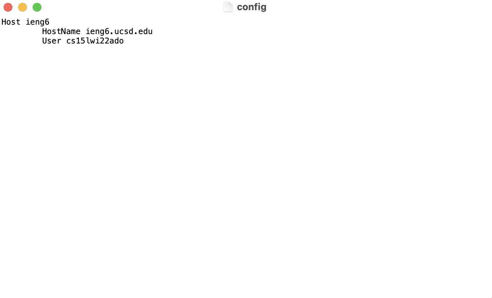
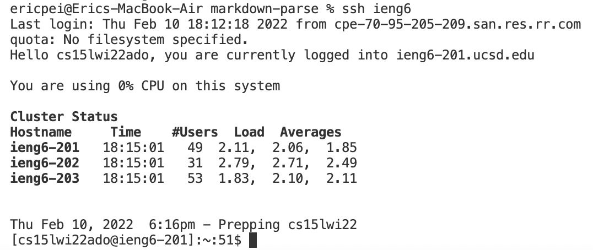
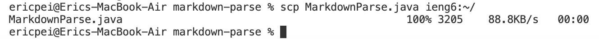

# __Week 6 Lab Report__

I will show you how to log into the remote server without needing to type in your full username. You can choose an alias yourself and use that to log in instead, speeding up the process of logging in.
   

## Table of Contents:
* Configuring an Alias
* Logging in With The Alias
* Copying a File With The Alias
   

# Configuring an Alias
First, I typed in this command in the VSCode terminal to create the `.ssh/config` file:
   
`touch ~/.ssh/config`
   
Then, I opened the file using the command:
   
`open ~/.ssh/config`
   

   
I then proceeded to add the lines into the file shown in the screenshot above. This created an alias, `ieng6`, that I can use instead of having to type out `cse15lwi22ado@ieng6.ucsd.edu` every time.
   

# Logging in With The Alias

   
Now that the alias has been created, I can log into my account on the remote server by just typing:
   
`ssh ieng6`
   
This command contains fewer keystrokes and is therefore faster than before the alias was created.
   

# Copying a File With The Alias

   
Using the alias, I can also copy files over to the remote server. I typed this command to copy `MarkdownParse.java` over to `ieng6`:
   
`scp MarkdownParse.java ieng6:~/`
   
Again, this saves a lot of keystrokes and makes the process more efficient.
   
That concludes the end of my lab report.
   

[Go back to home page](https://ericwpei.github.io/cse15l-lab-reports/)