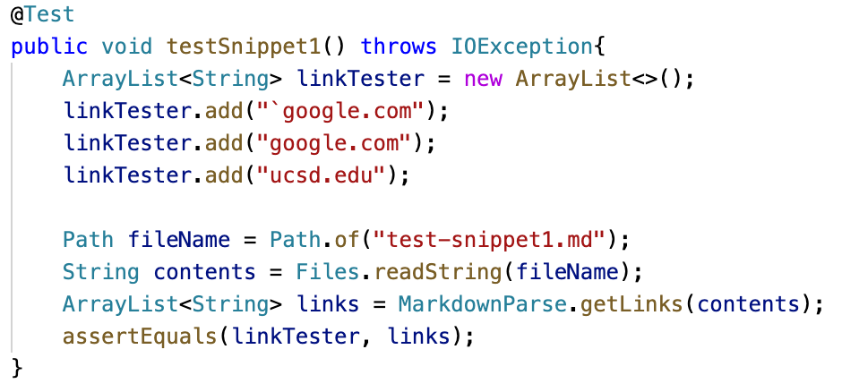

# __Week 8 Lab Report__

I will show you tests on 3 different markdown files using 2 different implementations of `MarkdownParse`. One is my implementation, and the other is another group's implementation. I will then explain whether or not fixing my implementation to pass the failed tests is a small fix.
<br/> <br/>

## Table of Contents:
* Code Snippet 1
* Code Snippet 2
* Code Snippet 3
<br/> <br/>

## Repository Links:
* [My repository](https://github.com/ericwpei/markdown-parse)
* [Repository that I reviewed](https://github.com/merrickqiu/markdown-parse)
<br/> <br/>

# Code Snippet 1
## Snippet 1 
```
`[a link`](url.com)

[another link](`google.com)`

[`cod[e`](google.com)

[`code]`](ucsd.edu)
```
should produce the following:


<br/> <br/>
Lines 2-4 are all links. This is the code I wrote in `MarkdownParseTest.java` to test if the `MarkdownParse` implementation worked for this code snippet:
<br/> <br/>


<br/> <br/>
When I ran the test on my implementation, it failed.
<br/> <br/>


<br/> <br/>

When I ran the test on the implementation I reviewed, it also failed.
<br/> <br/>


<br/> <br/>

I think fixing my implementation of `MarkdownParse` to pass the test with this code snippet would be less than 10 lines. If there are two backticks near a link, check to see if they are near the brackets. If one or more backticks are outside of the brackets, then it should not count as a link.

# Code Snippet 2
## Snippet 2
```
[a [nested link](a.com)](b.com)

[a nested parenthesized url](a.com(()))

[some escaped \[ brackets \]](example.com)
```
should produce the following:


<br/> <br/>
All of the lines include links. This is the code I wrote in `MarkdownParseTest.java` to test if the `MarkdownParse` implementation worked for this code snippet:
<br/> <br/>


<br/> <br/>
When I ran the test on my implementation, it failed.
<br/> <br/>


<br/> <br/>

When I ran the test on the implementation I reviewed, it also failed.
<br/> <br/>


<br/> <br/>

I think fixing my implementation of `MarkdownParse` to pass the test with this code snippet would be less than 10 lines. First, I would need to check to see if there are nested parentheses, brackets, or escaped brackets. Then, I would need to check if there is anything within any of these nested parentheses, brackets, or escaped brackets before determining which ones are actually links.

# Code Snippet 3
## Snippet 3
```
[this title text is really long and takes up more than 
one line

and has some line breaks](
    https://www.twitter.com
)

[this title text is really long and takes up more than 
one line](
    https://ucsd-cse15l-w22.github.io/
)


[this link doesn't have a closing parenthesis](github.com

And there's still some more text after that.

[this link doesn't have a closing parenthesis for a while](https://cse.ucsd.edu/


)

And then there's more text
```
should produce the following:


<br/> <br/>
Only the third line includes a link. This is the code I wrote in `MarkdownParseTest.java` to test if the `MarkdownParse` implementation worked for this code snippet:
<br/> <br/>


<br/> <br/>
When I ran the test on my implementation, it failed.
<br/> <br/>


<br/> <br/>

When I ran the test on the implementation I reviewed, it also failed.
<br/> <br/>


<br/> <br/>

I think fixing my implementation of `MarkdownParse` to pass the test with this code snippet would be less than 10 lines. I would first need to check for line breaks within the links to determine whether or not to include them. I would also need to get rid of the extra spaces within the links before I add them to the list of links.
<br/> <br/>
That concludes the end of my lab report.
<br/> <br/>

[Go back to home page](https://ericwpei.github.io/cse15l-lab-reports/)