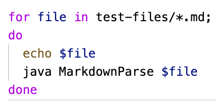
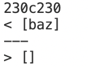
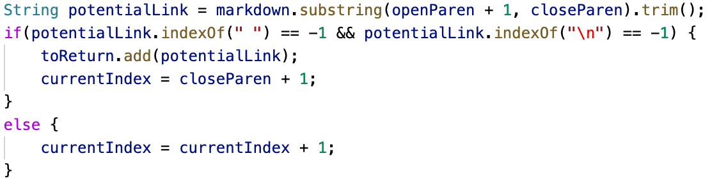
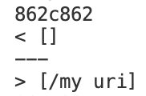
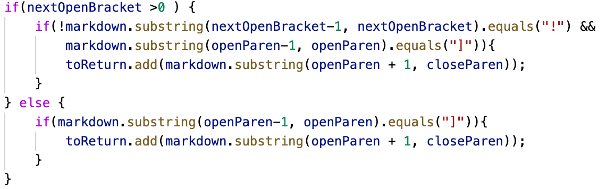

# __Week 10 Lab Report__

# Comparing My Implementation of MarkdownParse to the Instructor's

I will be comparing the outputs of 652 files between my implementation of MarkdownParse and the instructor's implementation of MarkdownParse. I will choose two specific tests and compare the differences in greater detail.
<br/> <br/>

## Table of Contents:
* How I Found Tests with Different Results
* Test 201
* Test 487
<br/> <br/>

# How I Found Tests with Different Results
First, I ran `MarkdownParse.java` with all 652 test files using a script called `script.sh`:
<br/> <br/>

<br/> <br/>
I ran the script with the command 
```
bash script.sh > results.txt
```
to copy all of the output from running the script onto a file called `results.txt`. I did this for both my implementation and the instructor's.
<br/> <br/>
Then, I ran the command
```
diff markdown-parse/results.txt my-markdown-parse/results.txt
```
to show all the outputs that differed between my implementation and the instructor's.

# Test 201
The test file `201.md` contains:
```
[foo]: <bar>(baz)

[foo]
```
The `diff` command outputted:
<br/> <br/>

<br/> <br/>
This means that the instructor's implementation outputted:
```
[baz]
```
And my implementation outputted:
```
[]
```
According to the [CommonMark demo site](https://spec.commonmark.org/dingus/), this test file contains no links, so my implementation would be correct.
<br/> <br/>
## The Bug
The text in `201.md` that the instructor's implementation thinks has a link is:
```
[foo]: <bar>(baz)
```
The reason this isn't a link is because there are characters between the close bracket and the open parenthesis.
<br/> <br/>

<br/> <br/>
Here is the code in the instructor's `MarkdownParse.java`. The bug is that there is no check to see that `openParen` is 1 index greater than `nextCloseBracket`. There should be an if statement that checks this, and if it is true, then the line of text is a link and should be added to `toReturn`.

# Test 487
The test file `487.md` contains:
```
[link](/my uri)
```
The `diff` command outputted:
<br/> <br/>

<br/> <br/>
This means that the instructor's implementation outputted:
```
[]
```
And my implementation outputted:
```
[/my uri]
```
According to the [CommonMark demo site](https://spec.commonmark.org/dingus/), this test file also contains no links, so the instructor's implementation would be correct.
<br/> <br/>
## The Bug
The reason `[link](/my uri)` isn't a link is because there is a space separating the text within the parentheses. Spaces before and after the text within the parentheses are fine, but there cannot be any spaces in the middle.
<br/> <br/>

<br/> <br/>
Here is the code in my `MarkdownParse.java`. The bug is that there is no check to see what is actually within the parentheses. There should be an if statement that checks that there are no spaces in between text within the parentheses. If this is true, then the line of text is a link and should be added to `toReturn`.
<br/> <br/>
That concludes the end of my lab report.
<br/> <br/>

[Go back to home page](https://ericwpei.github.io/cse15l-lab-reports/)